How to Yield Farm on CheeseSwap

​
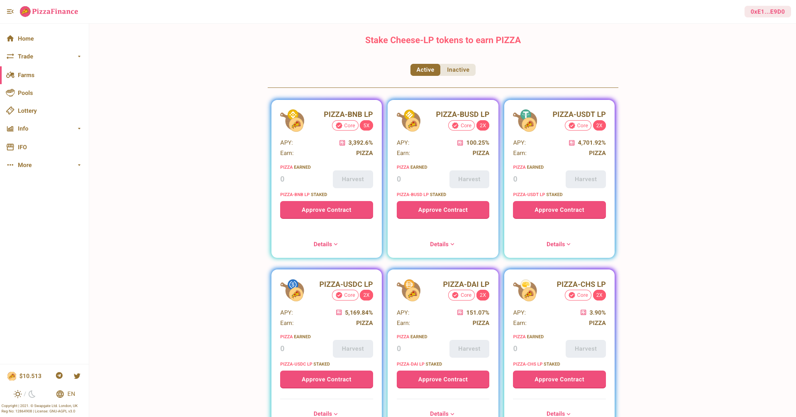

1. Go to the farm page here.

​

2. Connect your Binance Smart Chain Wallet (top-right hand corner)

​
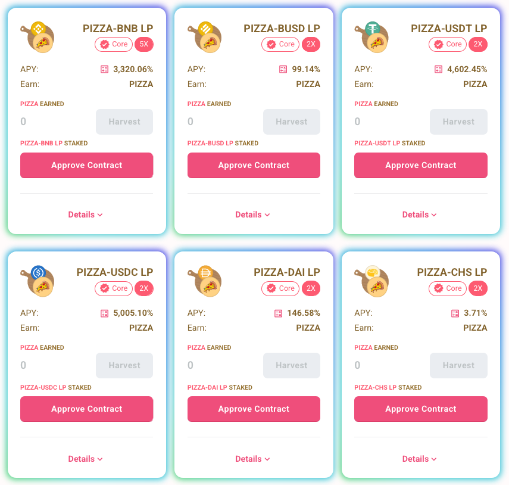

3. Pick which farm you want to use. For this example, we will pick the PIZZA-BNB farm.

​
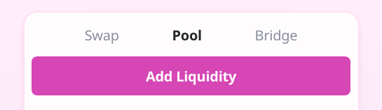

4. Go to the exchange page here and click “Pool” and then “Add Liquidity”.

​
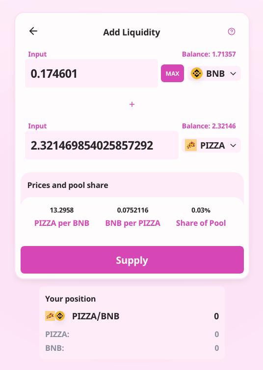

5. Select the tokens to add, in this case BNB and PIZZA. You need to provide them in a 50/50 ratio vs USD value.

For example, you would need to add $25 of BNB and $25 of PIZZA. Once you are done, click “Supply”.

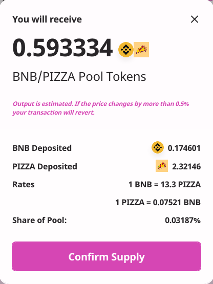 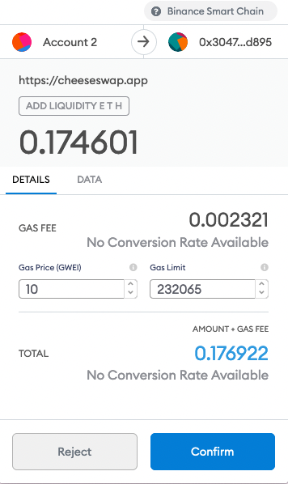
​​
6. Check the details, click “Confirm Supply” and then confirm the transaction in your wallet.

​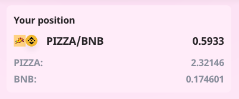

7. You now have liquidity tokens. Next, go back to the farm page here.

​
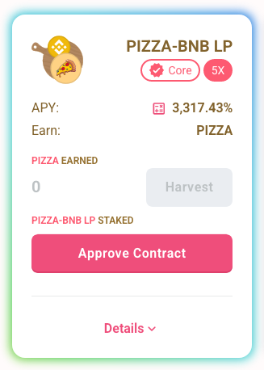

8. Click “Approve Contract” on the farm you want to use.

​
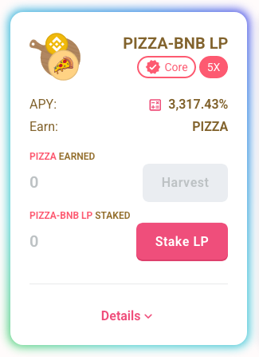

9. Click the “Stake LP” button to stake your liquidity tokens.

​
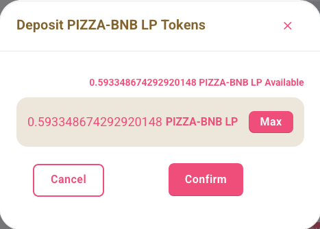

10. Enter the number of liquidity tokens you want to stake and click “Confirm”.

​
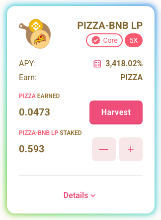

11. Done! Now you are farming PIZZA tokens!
