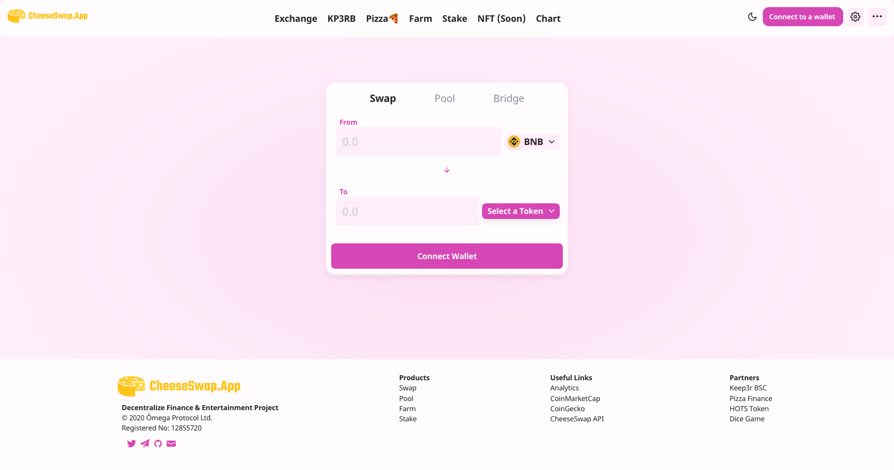
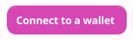
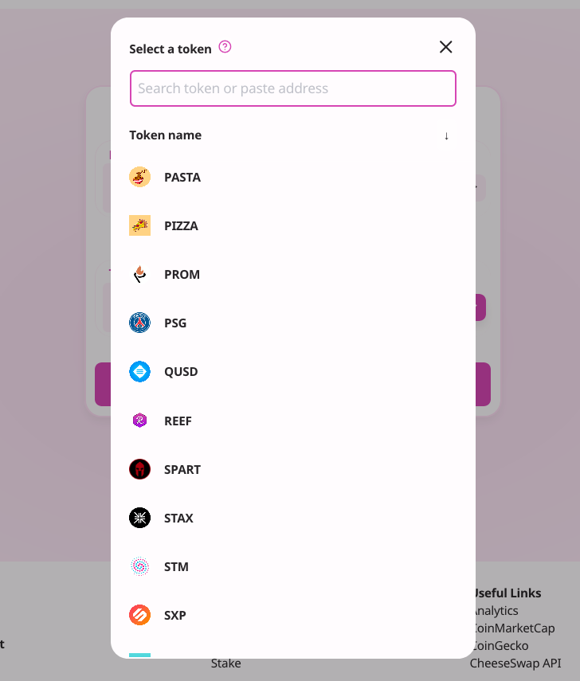
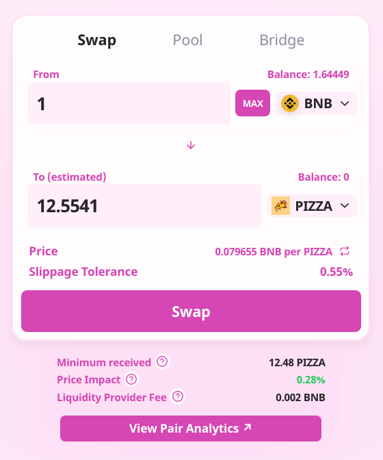
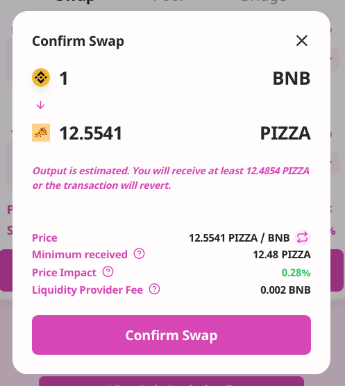
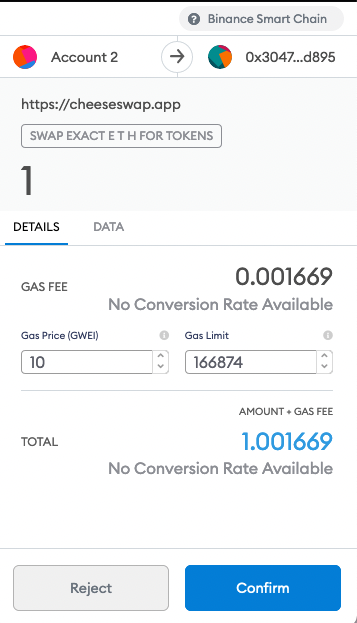
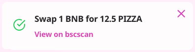

How to Trade on the CheeseSwap Exchange

​

1. Go to the exchange page here.

​

​

2. Unlock your Binance Smart Chain Wallet (top right-hand side).

​

3. Select the tokens you wish to trade and enter the amount.

​

​

4. Check the details, and click “Swap”.

​

​

5. Check the details and click “Confirm Swap”.

​

​

6. Confirm the transaction in your wallet.

​

7. Done! You can click “View on bscscan” to see your transaction details.
