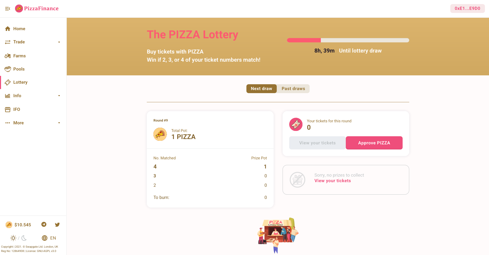
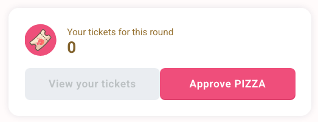
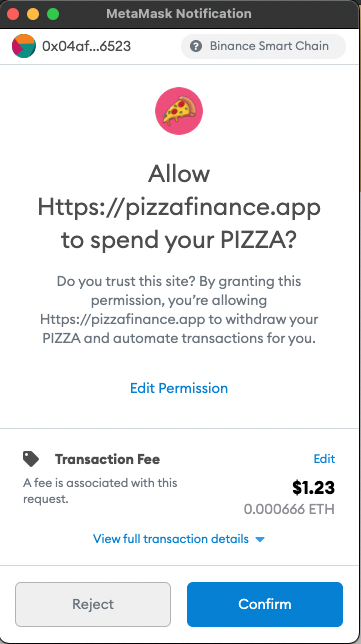
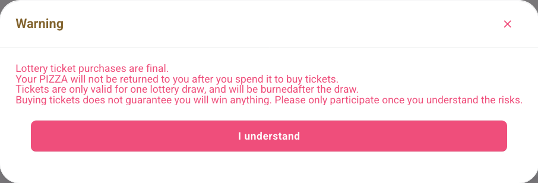
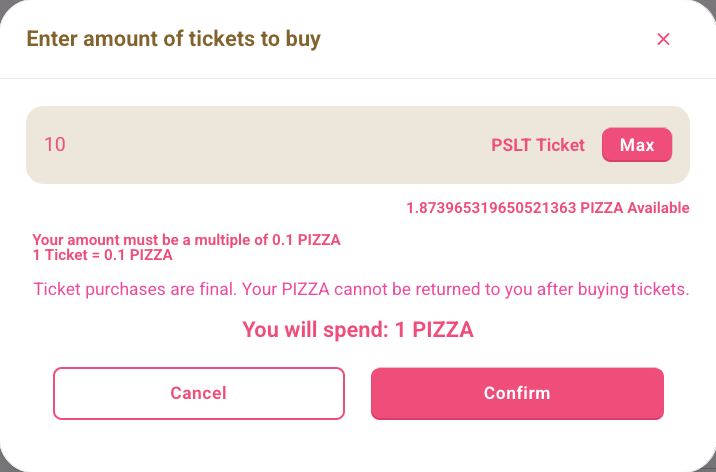
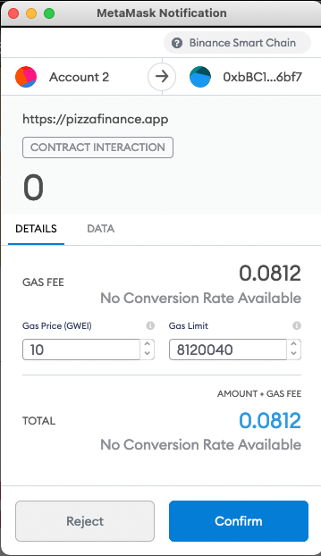
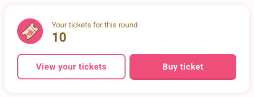
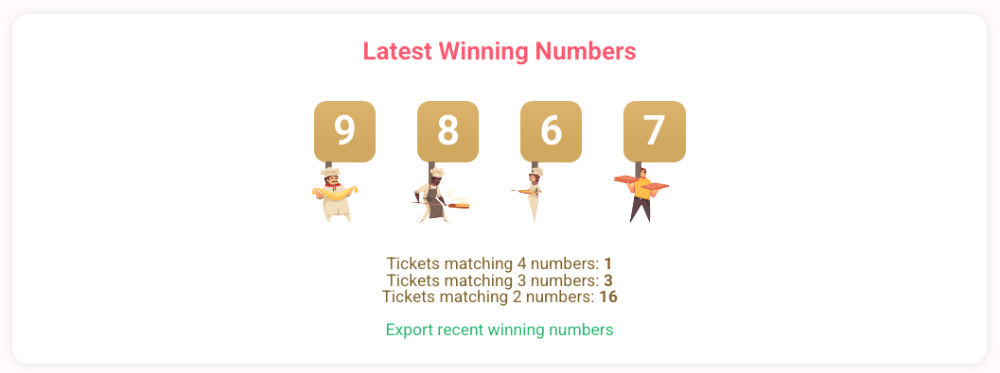

# How To Join Lottery

How to Take Part in the PizzaSwap Lottery

​

1. Go to the lottery page here.

​ 

1. Click on “Approve PIZZA”.

​

​​

1. Accept the contract by clicking on the “Confirm” button.

​

​​

1. Make sure you read the warnings, then click “I understand”.

​

​​

1. Click on “Buy Ticket”.

​

​​

1. Choose the number of tickets you want to buy then click on “Confirm”.

​

​​

1. Click on “Confirm”.

​  ​​

Done! You now have a chance to win the lottery.

You can check out your tickets by clicking on the “View your tickets” button.

At the bottom part of the page, you can see the live timer until lottery draw and also the latest winning numbers, along with the number of winners for each category of prizes.

​  ​​

Good luck!

