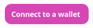
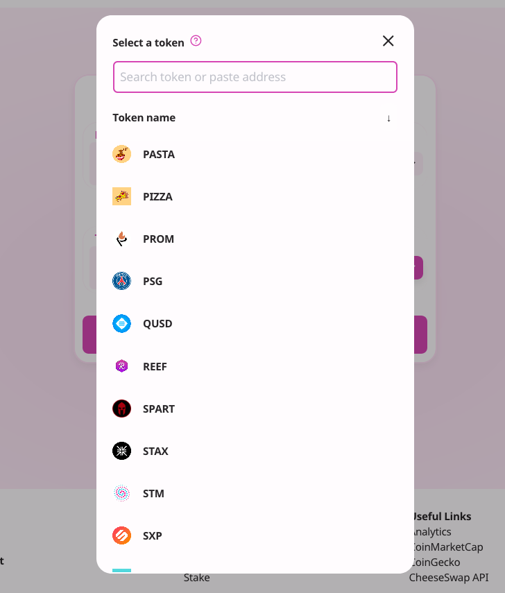
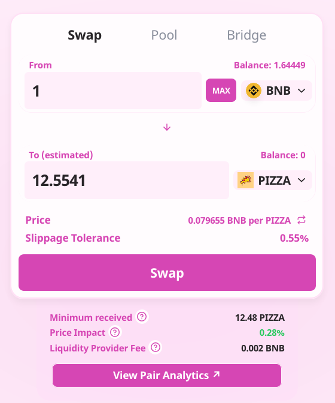
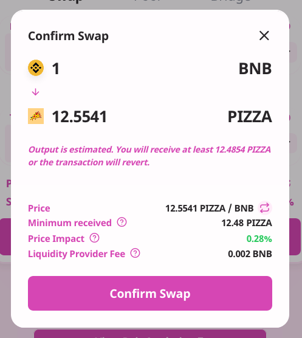
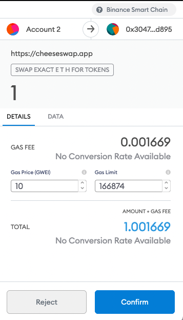
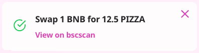

# How To Trade

How to Trade on the CheeseSwap Exchange

​

1. Go to the exchange page here.

​

​

1. Unlock your Binance Smart Chain Wallet \(top right-hand side\).

​

1. Select the tokens you wish to trade and enter the amount.

​

​

1. Check the details, and click “Swap”.

​

​

1. Check the details and click “Confirm Swap”.

​

​

1. Confirm the transaction in your wallet.

​

1. Done! You can click “View on bscscan” to see your transaction details.

